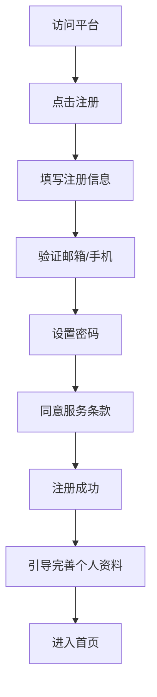
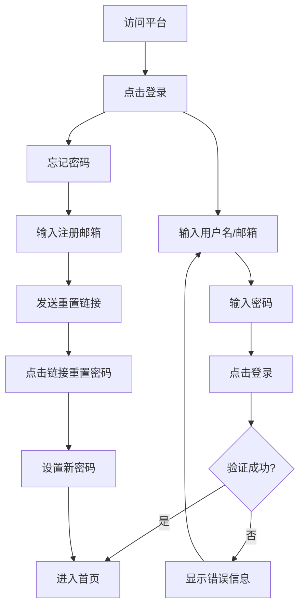
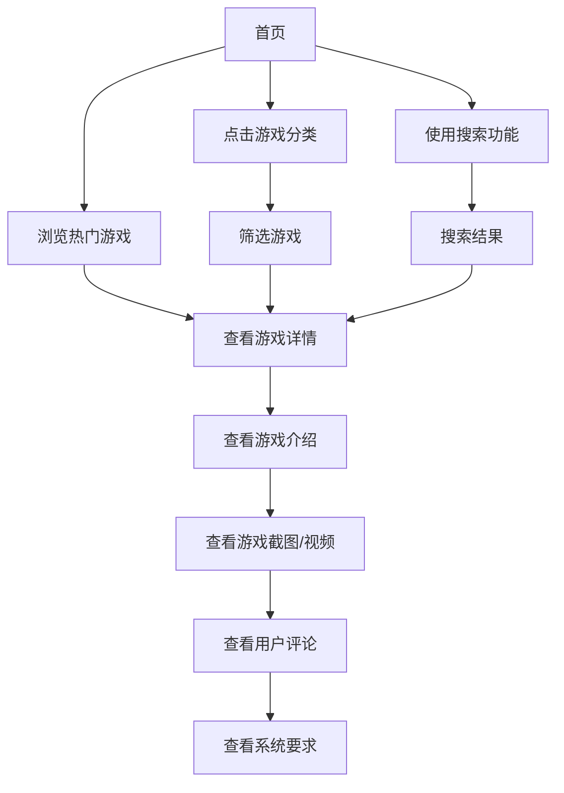
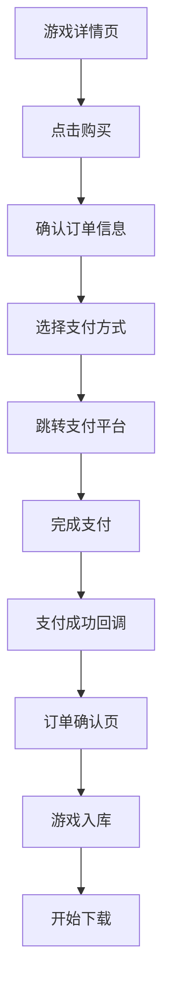
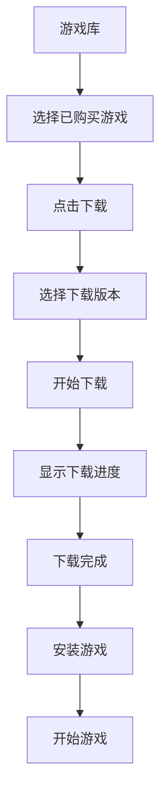
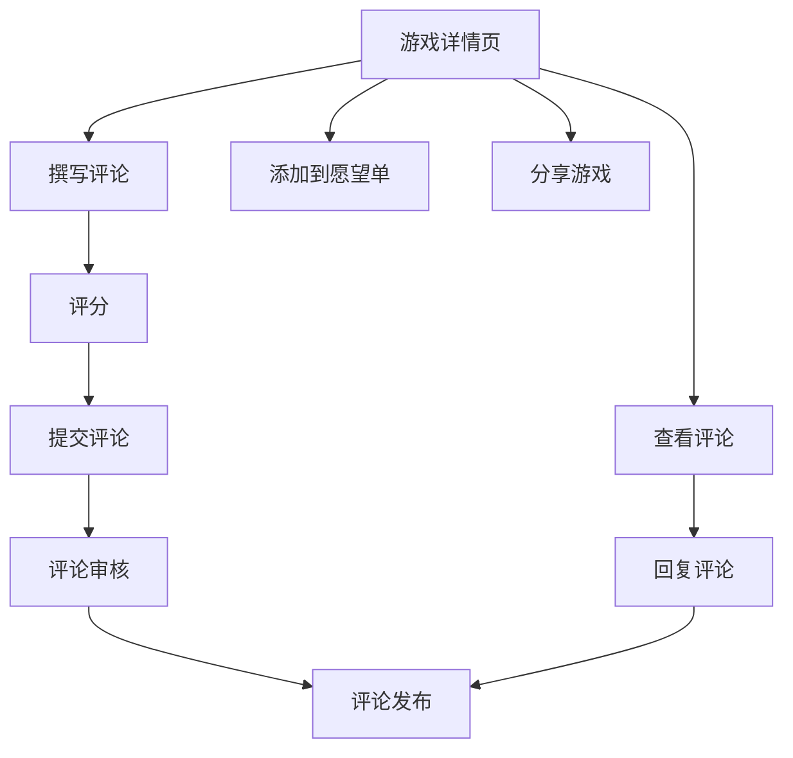

# 云幕游戏商店平台 - 用户体验设计文档

## 文档概述

本文档详细描述了云幕游戏商店平台的用户交互流程和用户体验设计，包括核心用户流程、界面设计原则、交互细节和响应式设计策略。

**文档版本**: v1.0  
**最后更新**: 2026-03-14  
**设计团队**: 云幕UI/UX团队

---

## 目录

1. [用户体验设计原则](#1-用户体验设计原则)
2. [核心用户流程](#2-核心用户流程)
3. [界面设计规范](#3-界面设计规范)
4. [交互设计细节](#4-交互设计细节)
5. [响应式设计策略](#5-响应式设计策略)
6. [用户测试计划](#6-用户测试计划)

---

## 1. 用户体验设计原则

### 1.1 设计理念

**核心设计理念**: 以用户为中心，提供流畅、直观、愉悦的游戏平台体验

### 1.2 设计原则

| 原则 | 描述 | 应用场景 |
|------|------|----------|
| **易用性** | 界面简洁明了，操作流程简单直观 | 所有用户操作 |
| **一致性** | 统一的视觉语言和交互模式 | 跨页面、跨功能 |
| **反馈性** | 及时、明确的操作反馈 | 按钮点击、表单提交、加载状态 |
| **可访问性** | 符合WCAG 2.1标准，支持辅助功能 | 全平台适用 |
| **性能优先** | 快速加载，流畅交互 | 页面加载、动画效果 |
| **情感化设计** | 愉悦的视觉体验，符合游戏平台特性 | 视觉设计、微交互 |

### 1.3 用户目标

| 用户类型 | 核心目标 | 次要目标 |
|----------|----------|----------|
| **新用户** | 快速注册/登录，了解平台功能 | 浏览热门游戏，下载客户端 |
| **普通用户** | 浏览游戏，购买游戏，下载游戏 | 参与社区互动，管理个人信息 |
| **资深用户** | 管理游戏库，参与社区活动 | 关注新游戏发布，享受会员权益 |
| **游戏开发者** | 发布游戏，管理游戏信息 | 查看销售数据，与玩家互动 |

---

## 2. 核心用户流程

### 2.1 用户注册流程

**关键交互点**:
- 实时表单验证，显示错误提示
- 密码强度可视化反馈
- 邮箱/手机验证码发送和验证
- 注册成功后的欢迎引导

### 2.2 用户登录流程

**关键交互点**:
- 记住登录状态
- 第三方登录选项
- 忘记密码流程
- 登录失败的错误提示

### 2.3 游戏浏览流程

**关键交互点**:
- 流畅的滚动体验
- 游戏卡片悬停效果
- 分类筛选的实时反馈
- 搜索结果的快速加载

### 2.4 游戏购买流程

**关键交互点**:
- 购物车功能
- 订单信息确认
- 多种支付方式选择
- 支付状态的实时反馈
- 购买成功后的游戏入库提示

### 2.5 游戏下载流程

**关键交互点**:
- 下载进度条
- 暂停/继续下载
- 多平台版本选择
- 下载完成的通知

### 2.6 社区互动流程

**关键交互点**:
- 评论的分页加载
- 评分的可视化展示
- 评论的回复功能
- 分享到社交平台

---

## 3. 界面设计规范

### 3.1 色彩系统

#### 3.1.1 主色调

| 色彩 | 色值 | 用途 |
|------|------|------|
| 主色 | #667eea | 品牌标识、主要按钮、强调元素 |
| 辅助色 | #764ba2 | 次要按钮、渐变效果 |
| 成功色 | #52c41a | 成功状态、确认按钮 |
| 警告色 | #faad14 | 警告状态、提示信息 |
| 错误色 | #f5222d | 错误状态、删除按钮 |
| 信息色 | #1890ff | 信息状态、链接 |

#### 3.1.2 中性色

| 色彩 | 色值 | 用途 |
|------|------|------|
| 背景色 | #f8f9fa | 页面背景 |
| 卡片色 | #ffffff | 卡片、面板背景 |
| 文本主色 | #333333 | 主要文本 |
| 文本次要色 | #666666 | 次要文本 |
| 文本提示色 | #999999 | 提示文本 |
| 边框色 | #e8e8e8 | 边框、分隔线 |

### 3.2 排版系统

#### 3.2.1 字体规范

| 字体 | 大小 | 字重 | 行高 | 用途 |
|------|------|------|------|------|
| 标题1 | 36px | 700 | 44px | 页面主标题 |
| 标题2 | 28px | 600 | 36px | 页面副标题 |
| 标题3 | 24px | 600 | 32px | 区块标题 |
| 标题4 | 20px | 600 | 28px | 卡片标题 |
| 正文 | 16px | 400 | 24px | 主要文本 |
| 辅助文本 | 14px | 400 | 20px | 辅助信息 |
| 小字 | 12px | 400 | 16px | 提示文本 |

#### 3.2.2 字体家族
- 主要字体：-apple-system, BlinkMacSystemFont, 'Segoe UI', 'Roboto', 'Oxygen', 'Ubuntu', 'Cantarell', 'Fira Sans', 'Droid Sans', 'Helvetica Neue', sans-serif
- 代码字体：source-code-pro, Menlo, Monaco, Consolas, 'Courier New', monospace

### 3.3 布局规范

#### 3.3.1 间距系统

| 间距 | 像素 | 用途 |
|------|------|------|
| XS | 4px | 微小间距 |
| SM | 8px | 小间距 |
| MD | 16px | 中等间距 |
| LG | 24px | 大间距 |
| XL | 32px | 超大间距 |
| XXL | 40px | 页面级间距 |

#### 3.3.2 响应式断点

| 断点 | 宽度 | 布局 |
|------|------|------|
| 移动端 | < 768px | 单列布局 |
| 平板 | 768px - 1024px | 双列布局 |
| 桌面 | > 1024px | 多列布局 |

### 3.4 组件规范

#### 3.4.1 按钮规范

| 类型 | 样式 | 尺寸 | 用途 |
|------|------|------|------|
| 主要按钮 | 渐变背景 | 大、中、小 | 主要操作 |
| 次要按钮 | 边框样式 | 大、中、小 | 次要操作 |
| 文本按钮 | 文本样式 | 中、小 | 辅助操作 |
| 图标按钮 | 图标样式 | 小 | 紧凑操作 |

#### 3.4.2 卡片规范
- 圆角：8px
- 阴影：0 2px 8px rgba(0,0,0,0.06)
- 悬停效果：transform: translateY(-5px), box-shadow: 0 10px 30px rgba(0,0,0,0.15)

#### 3.4.3 表单规范
- 输入框高度：40px
- 标签字体：14px
- 错误提示：红色文本，12px
- 验证状态：实时反馈

---

## 4. 交互设计细节

### 4.1 微交互设计

#### 4.1.1 按钮交互
- 悬停效果：轻微缩放和阴影变化
- 点击效果：按下状态的视觉反馈
- 加载状态：按钮内加载动画

#### 4.1.2 表单交互
- 输入框聚焦：边框颜色变化和轻微放大
- 验证反馈：实时验证，错误提示
- 提交按钮：提交状态的加载动画

#### 4.1.3 卡片交互
- 悬停效果：轻微上浮和阴影增强
- 点击效果：卡片轻微缩放
- 信息展示：鼠标悬停显示更多信息

### 4.2 加载状态设计

#### 4.2.1 页面加载
- 骨架屏：显示内容占位符
- 加载动画：品牌特色的加载动画
- 进度提示：重要操作的进度条

#### 4.2.2 数据加载
- 无限滚动：滚动到底部自动加载
- 分页加载：点击加载更多
- 预加载：预测性加载即将查看的内容

### 4.3 错误处理设计

#### 4.3.1 表单错误
- 实时验证：输入时即时反馈
- 错误提示：清晰的错误信息
- 焦点引导：自动聚焦到错误字段

#### 4.3.2 系统错误
- 错误页面：友好的错误提示页面
- 重试机制：提供重试按钮
- 反馈渠道：联系支持的选项

### 4.4 通知设计

#### 4.4.1 消息通知
- 顶部通知栏：重要系统通知
- 侧边通知：新消息提醒
- 操作反馈：操作成功/失败的Toast提示

#### 4.4.2 推送通知
- 游戏更新通知
- 促销活动通知
- 社区互动通知

---

## 5. 响应式设计策略

### 5.1 移动端设计

#### 5.1.1 导航设计
- 底部导航栏：常用功能入口
- 汉堡菜单：次要功能
- 搜索栏：顶部固定搜索

#### 5.1.2 内容布局
- 单列布局：垂直排列内容
- 卡片式设计：适合触摸操作
- 手势支持：滑动、捏合等手势

### 5.2 平板设计

#### 5.2.1 布局调整
- 双列布局：内容和侧边栏
- 响应式网格：自适应列数
- 触控优化：适当的点击区域

### 5.3 桌面设计

#### 5.3.1 空间利用
- 多列布局：充分利用宽屏空间
- 侧边栏：固定导航和筛选
- 悬停效果：丰富的鼠标交互

### 5.4 跨设备体验

#### 5.4.1 数据同步
- 云同步：用户数据跨设备同步
- 进度同步：游戏进度同步
- 购物车同步：跨设备购物车

#### 5.4.2 统一体验
- 一致的视觉语言
- 统一的交互模式
- 无缝的设备切换

---

## 6. 用户测试计划

### 6.1 测试目标
- 验证用户流程的顺畅性
- 识别界面设计的问题
- 评估系统响应时间
- 收集用户反馈和建议

### 6.2 测试方法

#### 6.2.1  usability测试
- 任务完成测试：用户完成特定任务的成功率
- 时间测量：完成任务的时间
- 错误率：操作错误的频率
- 满意度评分：用户对体验的评价

#### 6.2.2 A/B测试
- 不同设计方案的对比
- 关键指标的对比分析
- 数据驱动的设计决策

#### 6.2.3 问卷调查
- 用户满意度调查
- 功能重要性评估
- 改进建议收集

### 6.3 测试场景

| 测试场景 | 测试内容 | 预期结果 |
|----------|----------|----------|
| 新用户注册 | 注册流程的完整性和易用性 | 注册成功率 > 95% |
| 游戏搜索 | 搜索功能的准确性和速度 | 搜索响应时间 < 1秒 |
| 游戏购买 | 购买流程的顺畅性 | 购买完成率 > 90% |
| 游戏下载 | 下载流程的可靠性 | 下载成功率 > 98% |
| 社区互动 | 评论和评分功能 | 交互流畅无卡顿 |

### 6.4 测试指标

| 指标 | 目标值 | 测量方法 |
|------|--------|----------|
| 任务完成率 | > 90% | 完成任务数/总任务数 |
| 平均任务时间 | < 60秒 | 总时间/完成任务数 |
| 错误率 | < 5% | 错误次数/总操作次数 |
| 用户满意度 | > 4.5/5 | 问卷调查评分 |
| 系统响应时间 | < 200ms | 性能测试工具 |

---

## 附录

### A. 设计资源

- [UI设计系统](https://www.figma.com/file/xxx/云幕游戏商店设计系统)
- [交互原型](https://www.figma.com/file/xxx/云幕游戏商店交互原型)
- [设计规范文档](https://docs.yunmu.com/design/guidelines)

### B. 参考资料

- [尼尔森十大交互设计原则](https://www.nngroup.com/articles/ten-usability-heuristics/)
- [WCAG 2.1 可访问性指南](https://www.w3.org/TR/WCAG21/)
- [Google Material Design](https://material.io/design)
- [Apple Human Interface Guidelines](https://developer.apple.com/design/human-interface-guidelines/)

### C. 联系方式

- **设计团队**: design@yunmu.com
- **用户研究**: research@yunmu.com
- **前端开发**: frontend@yunmu.com

---

**文档结束**

本文档将随着项目进展持续更新和完善。