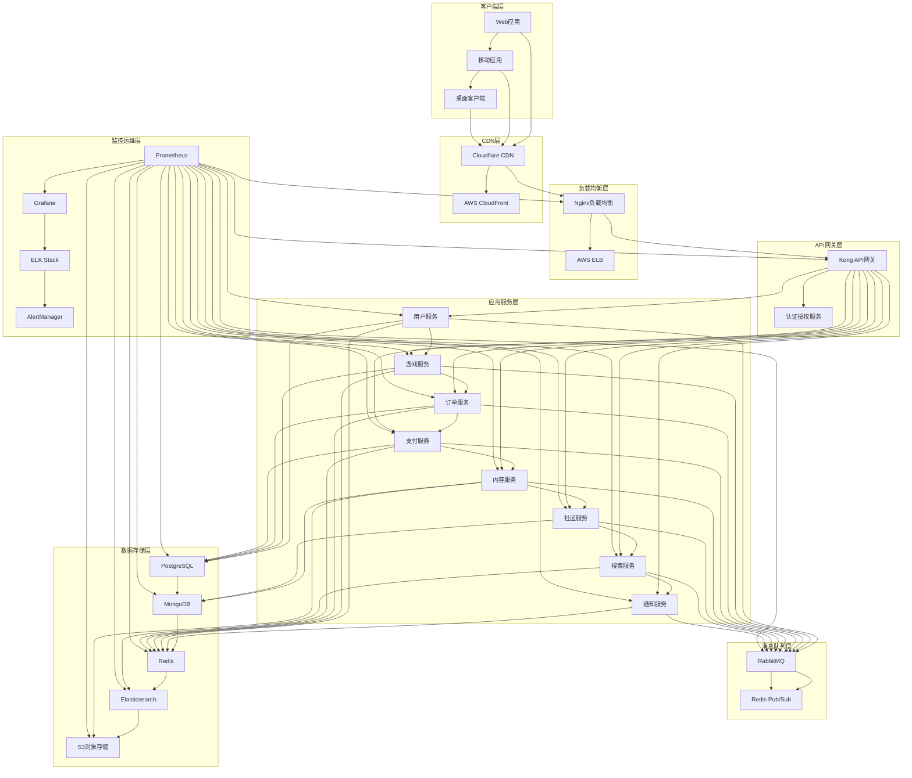
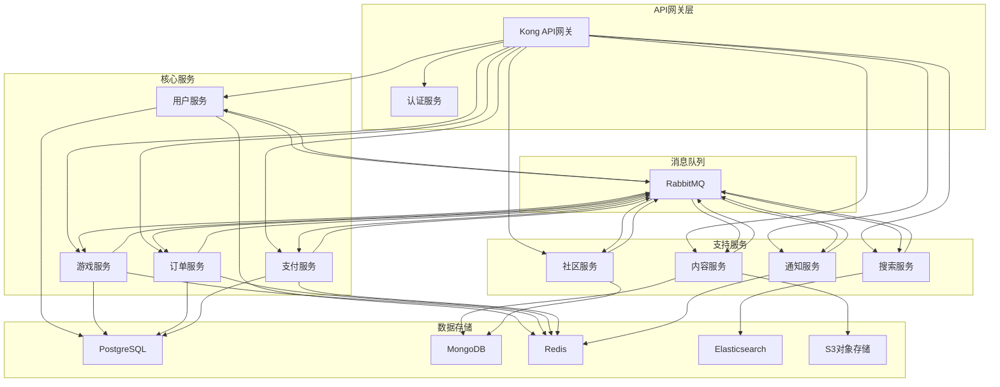
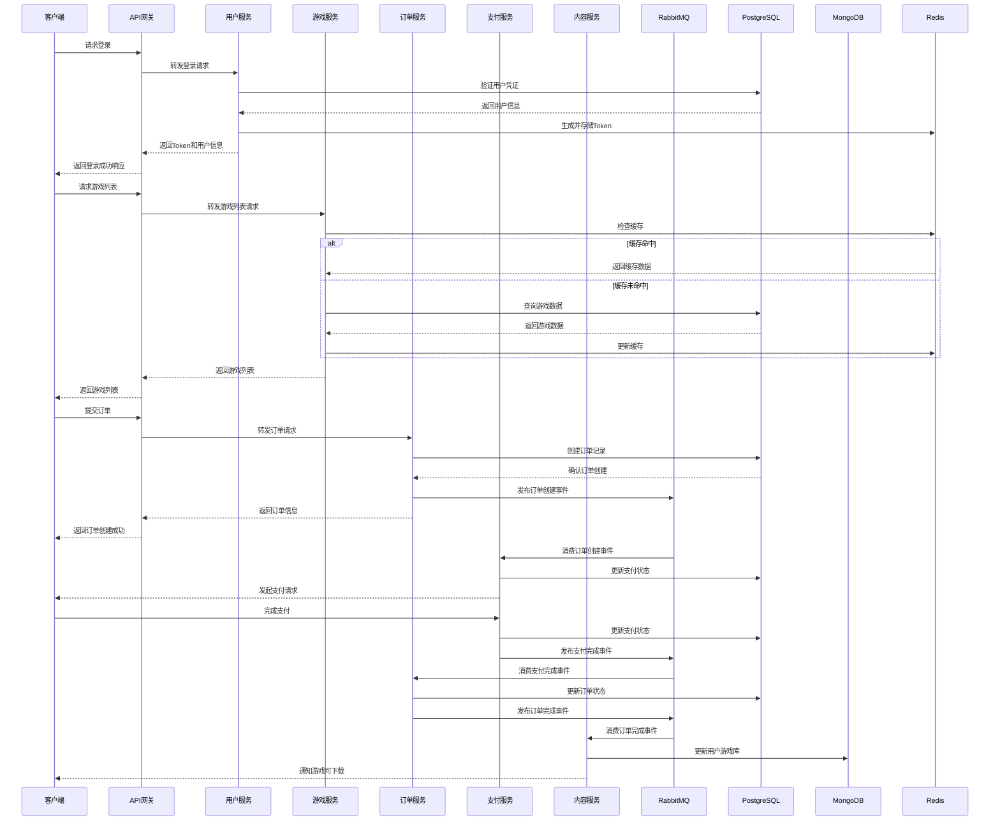
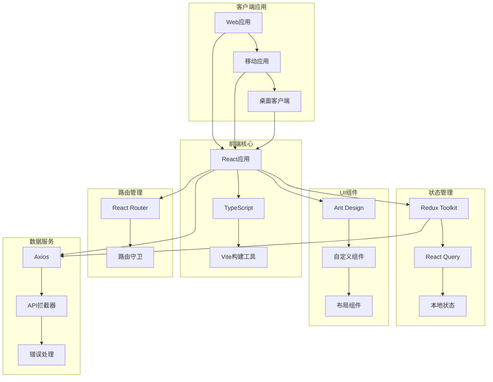
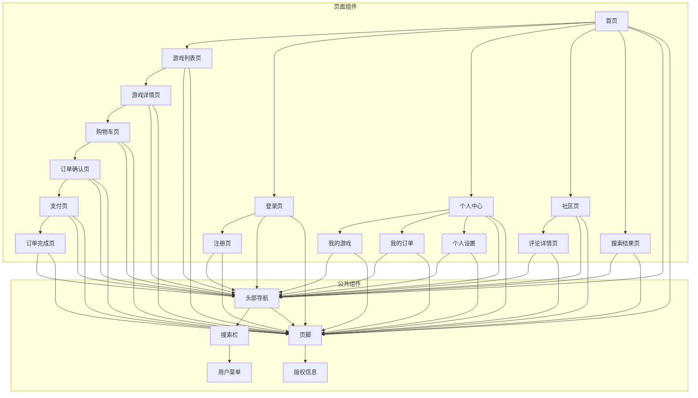
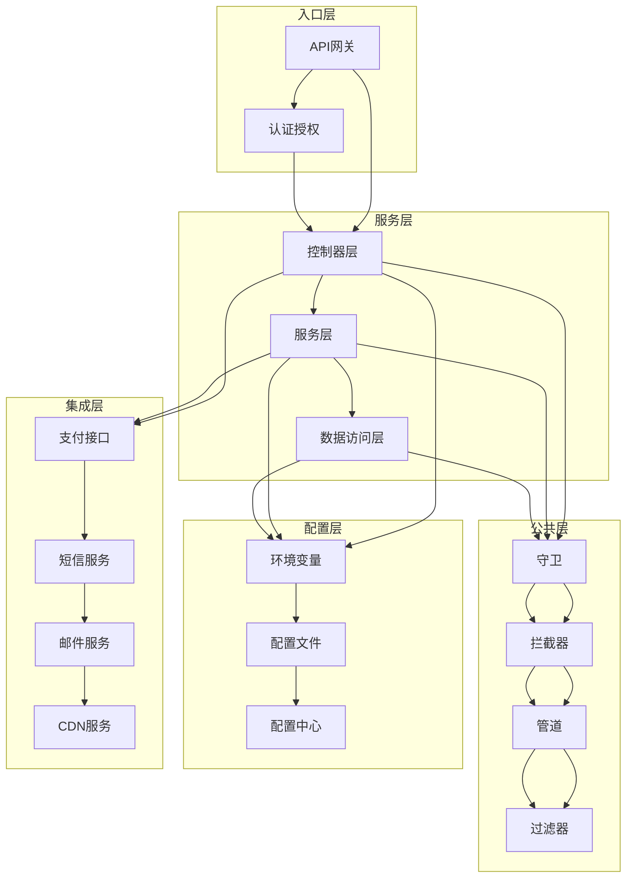
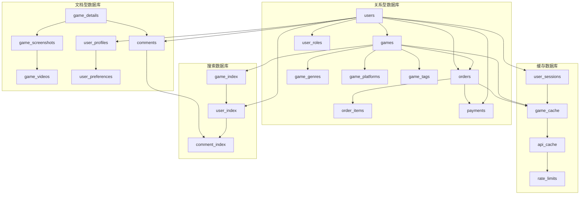
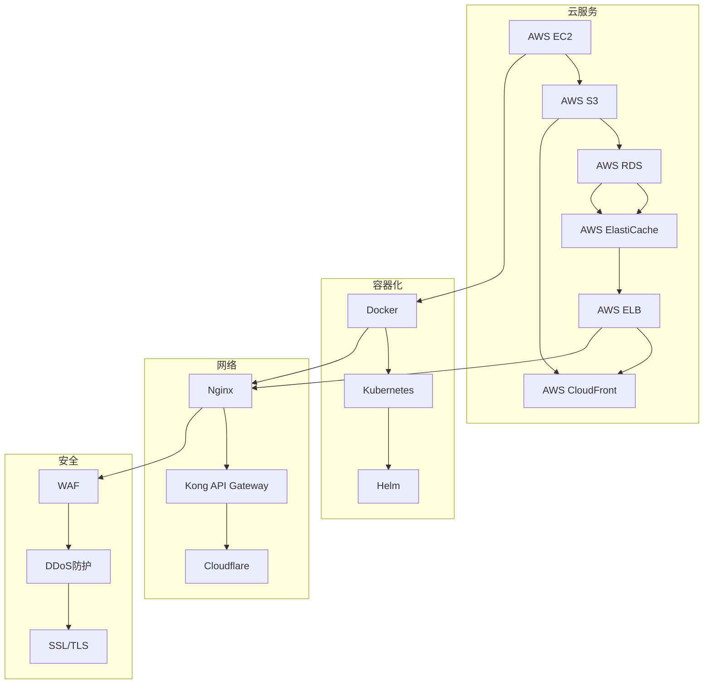
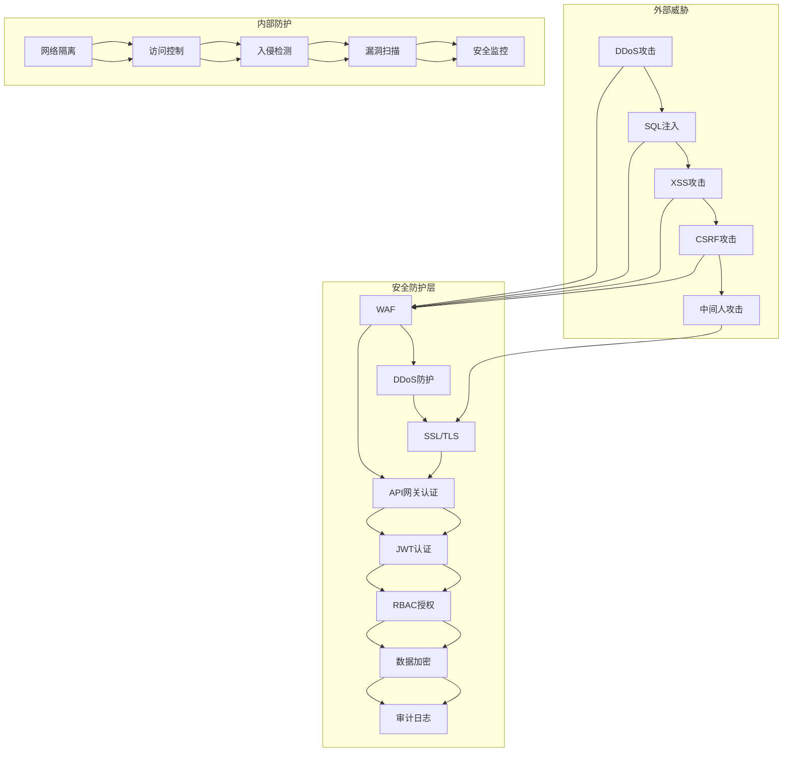
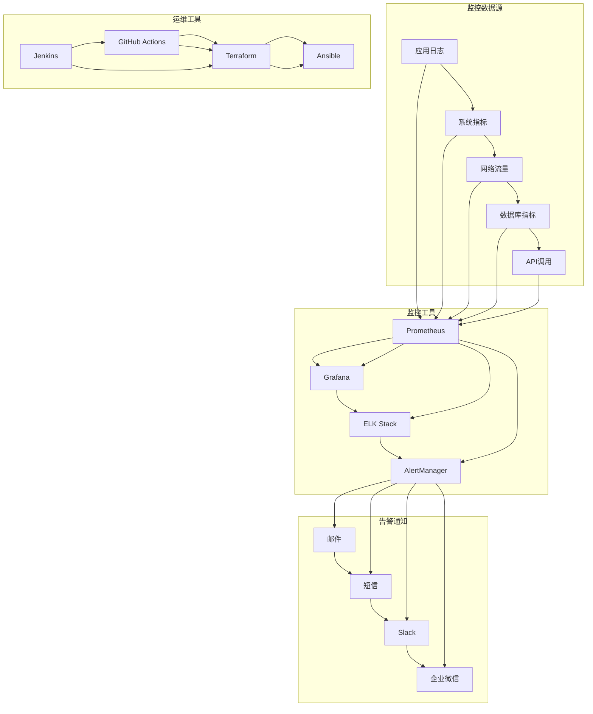

# 云幕游戏商店平台 - 系统架构图

## 文档概述

本文档提供了云幕游戏商店平台的详细系统架构图，包括整体架构、微服务架构、数据流设计等多个层面的架构设计。通过这些图表，清晰展示了系统各组件之间的关系和数据流向，为技术团队提供了系统架构的可视化参考。

**文档版本**: v1.0  
**最后更新**: 2026-03-14  
**技术团队**: 云幕技术团队

---

## 目录

1. [整体系统架构](#1-整体系统架构)
2. [微服务架构](#2-微服务架构)
3. [数据流程设计](#3-数据流程设计)
4. [前端架构](#4-前端架构)
5. [后端架构](#5-后端架构)
6. [数据库架构](#6-数据库架构)
7. [基础设施架构](#7-基础设施架构)
8. [安全架构](#8-安全架构)
9. [监控运维架构](#9-监控运维架构)

---

## 1. 整体系统架构

### 1.1 系统架构总览

### 1.2 架构层次说明

| 层次 | 组件 | 功能描述 |
|------|------|----------|
| **客户端层** | Web应用、移动应用、桌面客户端 | 用户访问入口，提供界面交互 |
| **CDN层** | Cloudflare CDN、AWS CloudFront | 内容分发网络，加速静态资源和API响应 |
| **负载均衡层** | Nginx负载均衡、AWS ELB | 分发流量，提高系统可用性 |
| **API网关层** | Kong API网关、认证授权服务 | 统一入口，路由转发，认证授权 |
| **应用服务层** | 微服务集群 | 处理核心业务逻辑 |
| **消息队列层** | RabbitMQ、Redis Pub/Sub | 异步通信，解耦服务 |
| **数据存储层** | PostgreSQL、MongoDB、Redis、Elasticsearch、S3 | 存储不同类型的数据 |
| **监控运维层** | Prometheus、Grafana、ELK Stack、AlertManager | 监控系统运行状态，保障系统稳定 |

---

## 2. 微服务架构

### 2.1 微服务组件图

### 2.2 微服务详细说明

| 服务 | 端口 | 技术栈 | 主要功能 | 依赖服务 |
|------|------|--------|----------|----------|
| **用户服务** | 3001 | NestJS + PostgreSQL | 用户管理、认证授权、个人资料 | PostgreSQL、Redis、RabbitMQ |
| **游戏服务** | 3002 | NestJS + PostgreSQL | 游戏管理、目录服务、游戏详情 | PostgreSQL、Redis、RabbitMQ |
| **订单服务** | 3003 | NestJS + PostgreSQL | 订单管理、交易处理、订单历史 | PostgreSQL、Redis、RabbitMQ |
| **支付服务** | 3004 | NestJS + PostgreSQL | 支付集成、退款处理、支付记录 | PostgreSQL、Redis、RabbitMQ |
| **内容服务** | 3005 | NestJS + MongoDB | 内容分发、下载管理、文件存储 | MongoDB、S3、RabbitMQ |
| **社区服务** | 3006 | NestJS + MongoDB | 社区互动、评论评分、用户生成内容 | MongoDB、RabbitMQ |
| **搜索服务** | 3007 | NestJS + Elasticsearch | 搜索引擎、推荐算法、搜索历史 | Elasticsearch、RabbitMQ |
| **通知服务** | 3008 | NestJS + Redis | 消息通知、推送服务、通知管理 | Redis、RabbitMQ |
| **API网关** | 8000 | Kong + PostgreSQL | API路由、请求转发、认证授权 | PostgreSQL |
| **认证服务** | 3009 | NestJS + Redis | Token管理、认证验证、权限控制 | Redis、RabbitMQ |

---

## 3. 数据流程设计

### 3.1 核心数据流程

### 3.2 数据流说明

| 流程 | 步骤 | 数据流向 | 说明 |
|------|------|----------|------|
| **用户登录** | 1-8 | 客户端 → API网关 → 用户服务 → PostgreSQL → Redis → API网关 → 客户端 | 验证用户凭证，生成Token |
| **游戏列表查询** | 9-20 | 客户端 → API网关 → 游戏服务 → Redis/PostgreSQL → API网关 → 客户端 | 优先使用缓存，缓存未命中时查询数据库 |
| **订单创建** | 21-28 | 客户端 → API网关 → 订单服务 → PostgreSQL → RabbitMQ → API网关 → 客户端 | 创建订单并发布事件 |
| **支付处理** | 29-35 | RabbitMQ → 支付服务 → PostgreSQL → 客户端 → 支付服务 → PostgreSQL → RabbitMQ | 处理支付并更新状态 |
| **订单完成** | 36-40 | RabbitMQ → 订单服务 → PostgreSQL → RabbitMQ | 更新订单状态并发布完成事件 |
| **游戏交付** | 41-44 | RabbitMQ → 内容服务 → MongoDB → 客户端 | 更新用户游戏库并通知可下载 |

---

## 4. 前端架构

### 4.1 前端组件架构

### 4.2 前端页面结构

---

## 5. 后端架构

### 5.1 后端服务架构

### 5.2 后端服务模块

| 模块 | 功能 | 技术实现 |
|------|------|----------|
| **控制器层** | 处理HTTP请求，参数验证，路由管理 | NestJS控制器 |
| **服务层** | 业务逻辑处理，事务管理，服务调用 | NestJS服务 |
| **数据访问层** | 数据库操作，ORM映射，数据转换 | Prisma ORM |
| **守卫** | 认证授权，权限检查，访问控制 | NestJS守卫 |
| **拦截器** | 请求/响应处理，日志记录，性能监控 | NestJS拦截器 |
| **管道** | 数据验证，类型转换，错误处理 | NestJS管道 |
| **过滤器** | 异常处理，错误响应，日志记录 | NestJS过滤器 |
| **配置管理** | 环境变量，配置文件，配置中心 | 环境变量 + 配置文件 |
| **外部集成** | 支付接口，短信服务，邮件服务 | 第三方SDK |

---

## 6. 数据库架构

### 6.1 数据库关系图

### 6.2 数据库职责划分

| 数据库 | 类型 | 主要职责 | 存储内容 |
|--------|------|----------|----------|
| **PostgreSQL** | 关系型 | 核心业务数据，事务处理 | 用户、游戏、订单、支付等结构化数据 |
| **MongoDB** | 文档型 | 非结构化数据，灵活存储 | 游戏详情、评论、用户资料等半结构化数据 |
| **Redis** | 缓存型 | 缓存、会话、限流 | 用户会话、API缓存、游戏缓存、速率限制 |
| **Elasticsearch** | 搜索型 | 全文搜索，推荐系统 | 游戏索引、用户索引、评论索引 |
| **S3** | 对象存储 | 大文件存储 | 游戏安装包、截图、视频等静态资源 |

---

## 7. 基础设施架构

### 7.1 基础设施架构图

### 7.2 基础设施组件

| 组件 | 类型 | 功能 | 技术实现 |
|------|------|------|----------|
| **计算服务** | 云服务 | 虚拟机实例 | AWS EC2 |
| **存储服务** | 云服务 | 对象存储 | AWS S3 |
| **数据库服务** | 云服务 | 托管数据库 | AWS RDS |
| **缓存服务** | 云服务 | 托管Redis | AWS ElastiCache |
| **负载均衡** | 云服务 | 流量分发 | AWS ELB |
| **CDN服务** | 云服务 | 内容分发 | AWS CloudFront |
| **容器管理** | 容器化 | 容器运行时 | Docker |
| **容器编排** | 容器化 | 容器管理 | Kubernetes |
| **应用部署** | 容器化 | 应用包管理 | Helm |
| **Web服务器** | 网络 | 反向代理 | Nginx |
| **API网关** | 网络 | API管理 | Kong |
| **CDN** | 网络 | 内容加速 | Cloudflare |
| **Web应用防火墙** | 安全 | 应用防护 | Cloudflare WAF |
| **DDoS防护** | 安全 | 流量防护 | Cloudflare DDoS |
| **SSL/TLS** | 安全 | 传输加密 | Let's Encrypt |

---

## 8. 安全架构

### 8.1 安全架构图

### 8.2 安全措施

| 安全层面 | 措施 | 技术实现 | 防护目标 |
|----------|------|----------|----------|
| **网络安全** | Web应用防火墙 | Cloudflare WAF | 防止SQL注入、XSS等攻击 |
| **网络安全** | DDoS防护 | Cloudflare DDoS | 防止分布式拒绝服务攻击 |
| **传输安全** | SSL/TLS | Let's Encrypt | 加密传输数据 |
| **认证安全** | JWT认证 | jsonwebtoken | 无状态认证 |
| **认证安全** | OAuth 2.0 | Passport.js | 第三方认证 |
| **授权安全** | RBAC | 自定义权限系统 | 基于角色的访问控制 |
| **数据安全** | 数据加密 | AES-256 | 敏感数据加密存储 |
| **数据安全** | 密码哈希 | bcrypt | 密码安全存储 |
| **操作安全** | 审计日志 | ELK Stack | 记录操作行为 |
| **操作安全** | 入侵检测 | Wazuh | 检测异常行为 |
| **操作安全** | 漏洞扫描 | OWASP ZAP | 发现安全漏洞 |
| **操作安全** | 安全监控 | Prometheus + Grafana | 监控安全事件 |

---

## 9. 监控运维架构

### 9.1 监控运维架构图

### 9.2 监控运维组件

| 组件 | 类型 | 功能 | 技术实现 |
|------|------|------|----------|
| **监控系统** | 监控工具 | 指标收集和存储 | Prometheus |
| **可视化工具** | 监控工具 | 指标可视化 | Grafana |
| **日志系统** | 监控工具 | 日志收集和分析 | ELK Stack |
| **告警系统** | 监控工具 | 告警管理和通知 | AlertManager |
| **CI/CD** | 运维工具 | 持续集成和部署 | Jenkins + GitHub Actions |
| **基础设施即代码** | 运维工具 | 基础设施管理 | Terraform |
| **配置管理** | 运维工具 | 配置自动化 | Ansible |
| **告警通知** | 告警通知 | 邮件通知 | SMTP |
| **告警通知** | 告警通知 | 短信通知 | 阿里云短信 |
| **告警通知** | 告警通知 | 即时通讯 | Slack + 企业微信 |

---

## 附录

### A. 架构设计原则

1. **高可用性**：多实例部署，负载均衡，故障自动切换
2. **可扩展性**：水平扩展，服务独立部署，按需扩容
3. **安全性**：多层防护，加密传输，访问控制
4. **性能优化**：缓存策略，CDN加速，数据库优化
5. **可维护性**：模块化设计，代码规范，自动化部署
6. **一致性**：数据一致性，服务一致性，接口一致性
7. **可靠性**：错误处理，重试机制，降级策略
8. **可观测性**：监控系统，日志系统，告警系统

### B. 架构演进规划

1. **第一阶段**：基础架构搭建，核心功能实现
   - 搭建微服务框架
   - 实现核心业务功能
   - 建立监控系统

2. **第二阶段**：性能优化，安全加固
   - 优化数据库查询
   - 实现缓存策略
   - 加强安全防护

3. **第三阶段**：功能扩展，生态建设
   - 增加新功能模块
   - 集成第三方服务
   - 构建开发者生态

4. **第四阶段**：智能化，自动化
   - 引入AI推荐系统
   - 实现自动化运维
   - 优化用户体验

### C. 架构决策记录

| 决策 | 日期 | 决策内容 | 决策理由 |
|------|------|----------|----------|
| 微服务架构 | 2026-03-01 | 采用微服务架构 | 提高系统可扩展性和可维护性 |
| 多数据库策略 | 2026-03-05 | 使用多种数据库 | 针对不同数据类型选择最合适的存储方案 |
| 容器化部署 | 2026-03-10 | 使用Docker和Kubernetes | 提高部署效率和环境一致性 |
| 云服务选择 | 2026-03-12 | 选择AWS作为云服务提供商 | 全球覆盖，服务丰富，可靠性高 |
| 安全架构 | 2026-03-14 | 采用多层安全防护 | 保障系统和数据安全 |

---

**文档结束**

本文档将随着项目进展持续更新和完善。