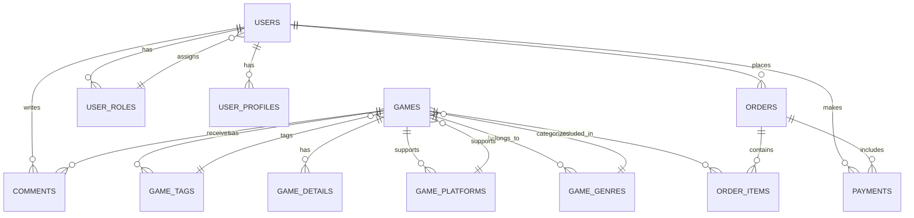
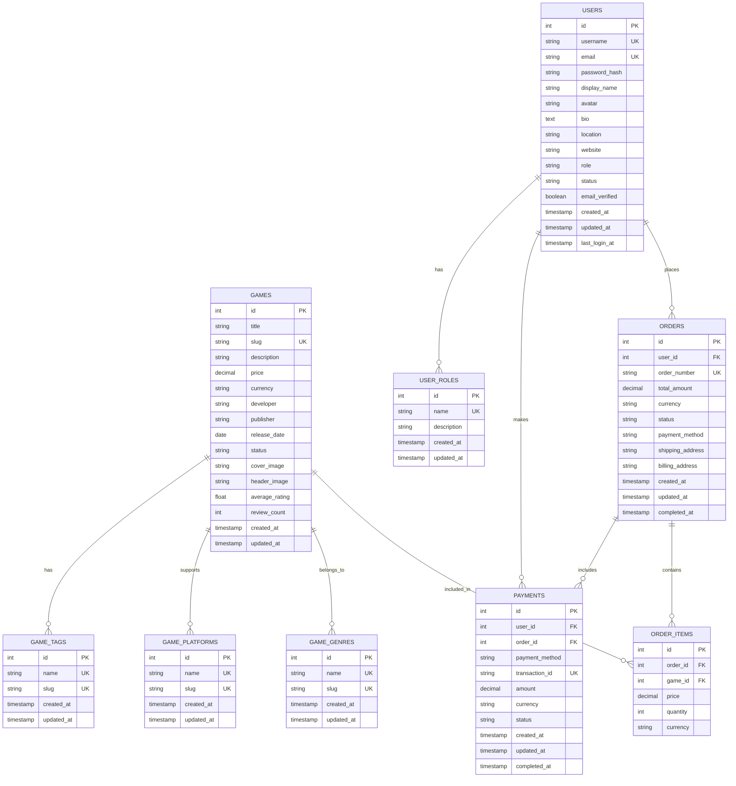
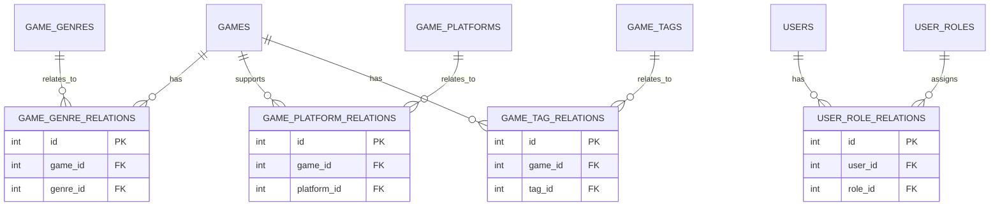
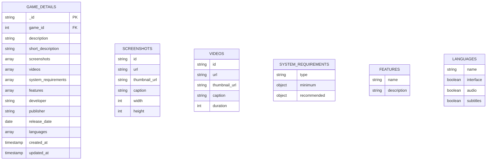
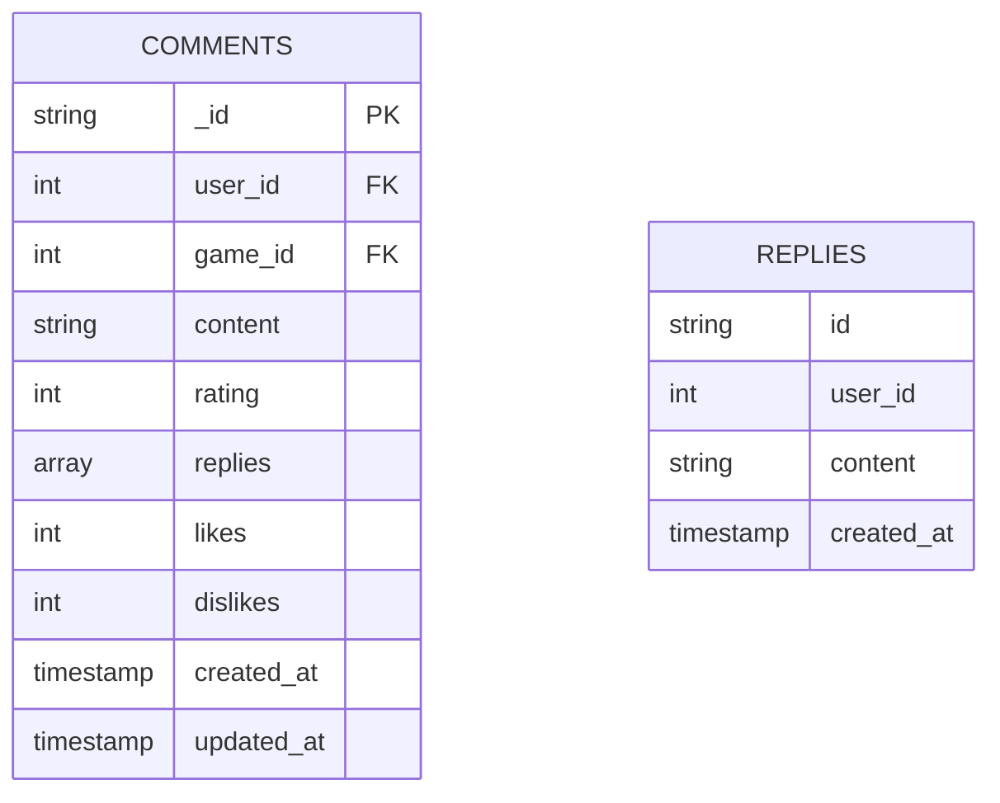
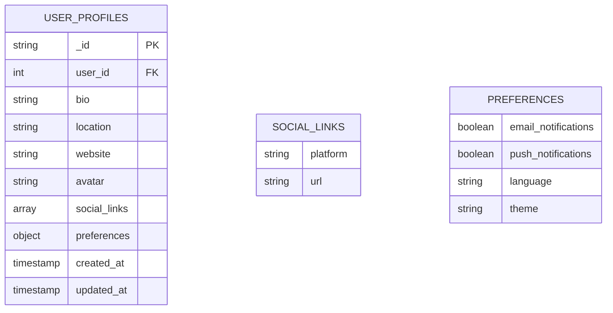
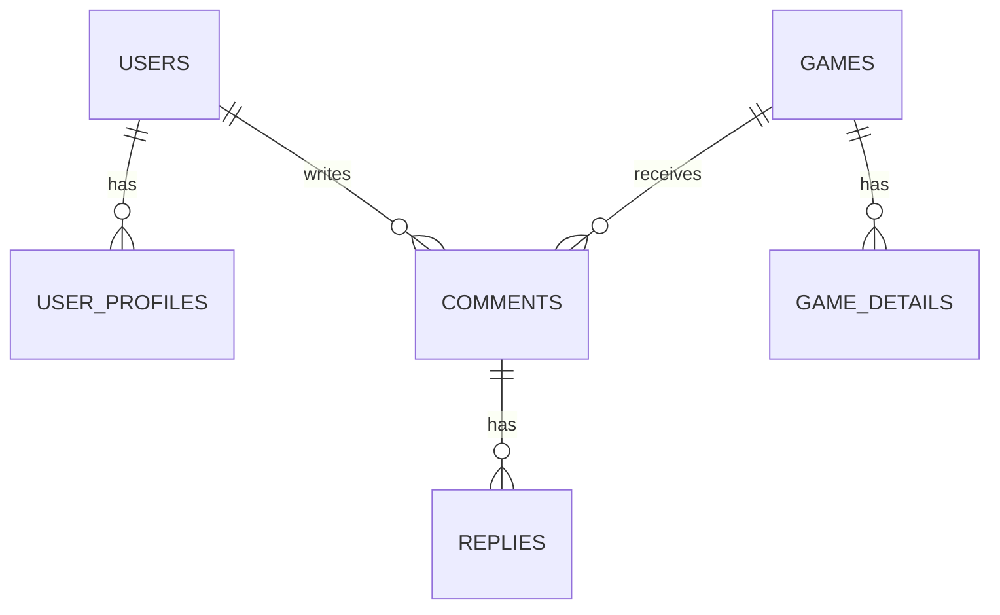
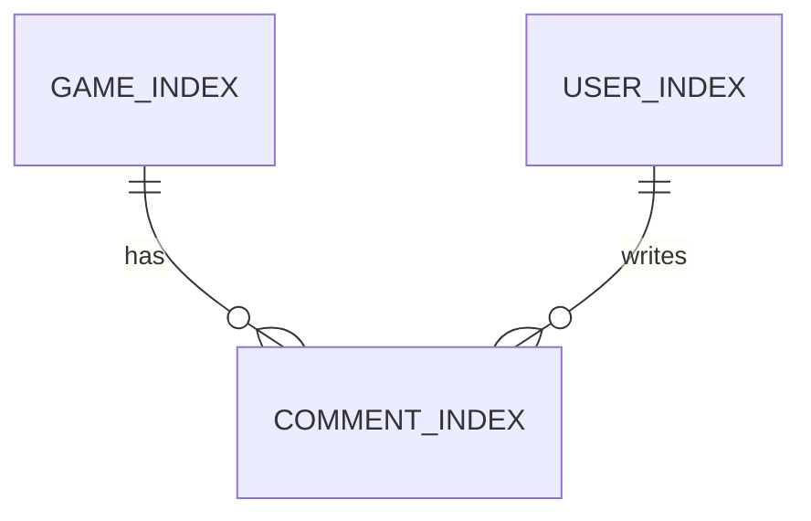

# 云幕游戏商店平台 - 数据库ER图

## 文档概述

本文档提供了云幕游戏商店平台的详细数据库实体关系图（ER图），包括关系型数据库（PostgreSQL）和文档型数据库（MongoDB）的实体、关系和属性定义。通过这些图表，清晰展示了数据库的结构和实体之间的关联关系，为数据库设计和开发提供了可视化参考。

**文档版本**: v1.0  
**最后更新**: 2026-03-14  
**技术团队**: 云幕技术团队

---

## 目录

1. [关系型数据库ER图](#1-关系型数据库er图)
2. [文档型数据库结构](#2-文档型数据库结构)
3. [缓存数据库设计](#3-缓存数据库设计)
4. [搜索数据库设计](#4-搜索数据库设计)
5. [数据字典](#5-数据字典)
6. [数据库关系说明](#6-数据库关系说明)

---

## 1. 关系型数据库ER图

### 1.1 核心实体关系图



### 1.2 详细实体关系图



### 1.3 多对多关系图



---

## 2. 文档型数据库结构

### 2.1 MongoDB集合结构

#### 2.1.1 game_details 集合



#### 2.1.2 comments 集合



#### 2.1.3 user_profiles 集合



### 2.2 MongoDB集合关系



---

## 3. 缓存数据库设计

### 3.1 Redis缓存键设计

| 缓存类型 | 键格式 | 说明 | 过期时间 |
|----------|--------|------|----------|
| **用户会话** | `user:session:{user_id}` | 用户会话数据 | 24小时 |
| **用户Token** | `user:token:{user_id}` | 用户JWT Token | 7天 |
| **游戏缓存** | `game:{game_id}` | 游戏详情缓存 | 1小时 |
| **游戏列表** | `games:list:{page}:{limit}:{sort}` | 游戏列表缓存 | 30分钟 |
| **游戏搜索** | `games:search:{query}:{page}:{limit}` | 搜索结果缓存 | 15分钟 |
| **API响应** | `api:{endpoint}:{params}` | API响应缓存 | 5-15分钟 |
| **速率限制** | `rate:limit:{ip}:{endpoint}` | 接口速率限制 | 1分钟 |
| **热点数据** | `hot:games` | 热门游戏缓存 | 30分钟 |
| **推荐游戏** | `recommend:games:{user_id}` | 推荐游戏缓存 | 1小时 |

### 3.2 Redis数据结构

```mermaid
erDiagram
    USER_SESSIONS {
        string key: user:session:{user_id}
        hash value: {user_id, username, email, role, last_active}
    }
    
    GAME_CACHE {
        string key: game:{game_id}
        hash value: {id, title, description, price, developer, publisher, cover_image, average_rating}
    }
    
    API_CACHE {
        string key: api:{endpoint}:{params}
        string value: JSON response
    }
    
    RATE_LIMITS {
        string key: rate:limit:{ip}:{endpoint}
        integer value: request count
    }
    
    HOT_GAMES {
        string key: hot:games
        sorted set value: {game_id, score}
    }
    
    RECOMMEND_GAMES {
        string key: recommend:games:{user_id}
        list value: [game_id1, game_id2, ...]
    }
```

---

## 4. 搜索数据库设计

### 4.1 Elasticsearch索引设计

#### 4.1.1 game_index 索引

| 字段 | 类型 | 说明 | 索引 |
|------|------|------|------|
| **id** | integer | 游戏ID | 否 |
| **title** | text | 游戏标题 | 是 |
| **slug** | keyword | 游戏别名 | 否 |
| **description** | text | 游戏描述 | 是 |
| **short_description** | text | 短描述 | 是 |
| **developer** | keyword | 开发商 | 是 |
| **publisher** | keyword | 发行商 | 是 |
| **genres** | keyword | 游戏类型 | 是 |
| **platforms** | keyword | 支持平台 | 是 |
| **tags** | keyword | 游戏标签 | 是 |
| **price** | float | 价格 | 否 |
| **average_rating** | float | 平均评分 | 否 |
| **review_count** | integer | 评论数量 | 否 |
| **release_date** | date | 发布日期 | 否 |
| **created_at** | date | 创建时间 | 否 |

#### 4.1.2 user_index 索引

| 字段 | 类型 | 说明 | 索引 |
|------|------|------|------|
| **id** | integer | 用户ID | 否 |
| **username** | keyword | 用户名 | 是 |
| **email** | keyword | 邮箱 | 否 |
| **display_name** | text | 显示名称 | 是 |
| **bio** | text | 个人简介 | 是 |
| **location** | keyword | 位置 | 是 |
| **role** | keyword | 用户角色 | 否 |
| **created_at** | date | 创建时间 | 否 |

#### 4.1.3 comment_index 索引

| 字段 | 类型 | 说明 | 索引 |
|------|------|------|------|
| **id** | string | 评论ID | 否 |
| **user_id** | integer | 用户ID | 否 |
| **game_id** | integer | 游戏ID | 否 |
| **content** | text | 评论内容 | 是 |
| **rating** | integer | 评分 | 否 |
| **likes** | integer | 点赞数 | 否 |
| **created_at** | date | 创建时间 | 否 |

### 4.2 Elasticsearch关系



---

## 5. 数据字典

### 5.1 关系型数据库表结构

#### 5.1.1 users 表

| 字段名 | 数据类型 | 约束 | 描述 |
|--------|----------|------|------|
| **id** | SERIAL | PRIMARY KEY | 用户ID |
| **username** | VARCHAR(50) | UNIQUE NOT NULL | 用户名 |
| **email** | VARCHAR(100) | UNIQUE NOT NULL | 邮箱 |
| **password_hash** | VARCHAR(255) | NOT NULL | 密码哈希 |
| **display_name** | VARCHAR(100) | NOT NULL | 显示名称 |
| **avatar** | VARCHAR(255) | | 头像URL |
| **bio** | TEXT | | 个人简介 |
| **location** | VARCHAR(100) | | 位置 |
| **website** | VARCHAR(255) | | 个人网站 |
| **role** | VARCHAR(20) | DEFAULT 'user' | 用户角色 |
| **status** | VARCHAR(20) | DEFAULT 'active' | 用户状态 |
| **email_verified** | BOOLEAN | DEFAULT FALSE | 邮箱是否验证 |
| **created_at** | TIMESTAMP | DEFAULT CURRENT_TIMESTAMP | 创建时间 |
| **updated_at** | TIMESTAMP | DEFAULT CURRENT_TIMESTAMP | 更新时间 |
| **last_login_at** | TIMESTAMP | | 最后登录时间 |

#### 5.1.2 games 表

| 字段名 | 数据类型 | 约束 | 描述 |
|--------|----------|------|------|
| **id** | SERIAL | PRIMARY KEY | 游戏ID |
| **title** | VARCHAR(255) | NOT NULL | 游戏标题 |
| **slug** | VARCHAR(255) | UNIQUE NOT NULL | 游戏别名 |
| **description** | TEXT | NOT NULL | 游戏描述 |
| **price** | DECIMAL(10,2) | NOT NULL | 游戏价格 |
| **currency** | VARCHAR(10) | NOT NULL | 货币类型 |
| **developer** | VARCHAR(255) | NOT NULL | 开发商 |
| **publisher** | VARCHAR(255) | NOT NULL | 发行商 |
| **release_date** | DATE | | 发布日期 |
| **status** | VARCHAR(20) | DEFAULT 'published' | 游戏状态 |
| **cover_image** | VARCHAR(255) | NOT NULL | 封面图片URL |
| **header_image** | VARCHAR(255) | | 头部图片URL |
| **average_rating** | FLOAT | DEFAULT 0 | 平均评分 |
| **review_count** | INTEGER | DEFAULT 0 | 评论数量 |
| **created_at** | TIMESTAMP | DEFAULT CURRENT_TIMESTAMP | 创建时间 |
| **updated_at** | TIMESTAMP | DEFAULT CURRENT_TIMESTAMP | 更新时间 |

#### 5.1.3 orders 表

| 字段名 | 数据类型 | 约束 | 描述 |
|--------|----------|------|------|
| **id** | SERIAL | PRIMARY KEY | 订单ID |
| **user_id** | INTEGER | REFERENCES users(id) | 用户ID |
| **order_number** | VARCHAR(50) | UNIQUE NOT NULL | 订单号 |
| **total_amount** | DECIMAL(10,2) | NOT NULL | 总金额 |
| **currency** | VARCHAR(10) | NOT NULL | 货币类型 |
| **status** | VARCHAR(20) | DEFAULT 'pending' | 订单状态 |
| **payment_method** | VARCHAR(50) | | 支付方式 |
| **shipping_address** | TEXT | | 收货地址 |
| **billing_address** | TEXT | |  billing地址 |
| **created_at** | TIMESTAMP | DEFAULT CURRENT_TIMESTAMP | 创建时间 |
| **updated_at** | TIMESTAMP | DEFAULT CURRENT_TIMESTAMP | 更新时间 |
| **completed_at** | TIMESTAMP | | 完成时间 |

#### 5.1.4 order_items 表

| 字段名 | 数据类型 | 约束 | 描述 |
|--------|----------|------|------|
| **id** | SERIAL | PRIMARY KEY | 订单项ID |
| **order_id** | INTEGER | REFERENCES orders(id) | 订单ID |
| **game_id** | INTEGER | REFERENCES games(id) | 游戏ID |
| **price** | DECIMAL(10,2) | NOT NULL | 单价 |
| **quantity** | INTEGER | NOT NULL | 数量 |
| **currency** | VARCHAR(10) | NOT NULL | 货币类型 |

#### 5.1.5 payments 表

| 字段名 | 数据类型 | 约束 | 描述 |
|--------|----------|------|------|
| **id** | SERIAL | PRIMARY KEY | 支付ID |
| **user_id** | INTEGER | REFERENCES users(id) | 用户ID |
| **order_id** | INTEGER | REFERENCES orders(id) | 订单ID |
| **payment_method** | VARCHAR(50) | NOT NULL | 支付方式 |
| **transaction_id** | VARCHAR(100) | UNIQUE NOT NULL | 交易ID |
| **amount** | DECIMAL(10,2) | NOT NULL | 支付金额 |
| **currency** | VARCHAR(10) | NOT NULL | 货币类型 |
| **status** | VARCHAR(20) | DEFAULT 'pending' | 支付状态 |
| **created_at** | TIMESTAMP | DEFAULT CURRENT_TIMESTAMP | 创建时间 |
| **updated_at** | TIMESTAMP | DEFAULT CURRENT_TIMESTAMP | 更新时间 |
| **completed_at** | TIMESTAMP | | 完成时间 |

#### 5.1.6 game_genres 表

| 字段名 | 数据类型 | 约束 | 描述 |
|--------|----------|------|------|
| **id** | SERIAL | PRIMARY KEY | 类型ID |
| **name** | VARCHAR(100) | UNIQUE NOT NULL | 类型名称 |
| **slug** | VARCHAR(100) | UNIQUE NOT NULL | 类型别名 |
| **created_at** | TIMESTAMP | DEFAULT CURRENT_TIMESTAMP | 创建时间 |
| **updated_at** | TIMESTAMP | DEFAULT CURRENT_TIMESTAMP | 更新时间 |

#### 5.1.7 game_platforms 表

| 字段名 | 数据类型 | 约束 | 描述 |
|--------|----------|------|------|
| **id** | SERIAL | PRIMARY KEY | 平台ID |
| **name** | VARCHAR(100) | UNIQUE NOT NULL | 平台名称 |
| **slug** | VARCHAR(100) | UNIQUE NOT NULL | 平台别名 |
| **created_at** | TIMESTAMP | DEFAULT CURRENT_TIMESTAMP | 创建时间 |
| **updated_at** | TIMESTAMP | DEFAULT CURRENT_TIMESTAMP | 更新时间 |

#### 5.1.8 game_tags 表

| 字段名 | 数据类型 | 约束 | 描述 |
|--------|----------|------|------|
| **id** | SERIAL | PRIMARY KEY | 标签ID |
| **name** | VARCHAR(100) | UNIQUE NOT NULL | 标签名称 |
| **slug** | VARCHAR(100) | UNIQUE NOT NULL | 标签别名 |
| **created_at** | TIMESTAMP | DEFAULT CURRENT_TIMESTAMP | 创建时间 |
| **updated_at** | TIMESTAMP | DEFAULT CURRENT_TIMESTAMP | 更新时间 |

#### 5.1.9 user_roles 表

| 字段名 | 数据类型 | 约束 | 描述 |
|--------|----------|------|------|
| **id** | SERIAL | PRIMARY KEY | 角色ID |
| **name** | VARCHAR(50) | UNIQUE NOT NULL | 角色名称 |
| **description** | TEXT | | 角色描述 |
| **created_at** | TIMESTAMP | DEFAULT CURRENT_TIMESTAMP | 创建时间 |
| **updated_at** | TIMESTAMP | DEFAULT CURRENT_TIMESTAMP | 更新时间 |

#### 5.1.10 关联表

| 表名 | 字段1 | 字段2 | 描述 |
|------|-------|-------|------|
| **game_genre_relations** | game_id | genre_id | 游戏-类型关联 |
| **game_platform_relations** | game_id | platform_id | 游戏-平台关联 |
| **game_tag_relations** | game_id | tag_id | 游戏-标签关联 |
| **user_role_relations** | user_id | role_id | 用户-角色关联 |

### 5.2 文档型数据库结构

#### 5.2.1 game_details 集合

| 字段名 | 数据类型 | 描述 |
|--------|----------|------|
| **_id** | ObjectId | 文档ID |
| **game_id** | Integer | 游戏ID |
| **description** | String | 详细描述 |
| **short_description** | String | 短描述 |
| **screenshots** | Array | 截图数组 |
| **videos** | Array | 视频数组 |
| **system_requirements** | Object | 系统要求 |
| **features** | Array | 游戏特性 |
| **developer** | String | 开发商 |
| **publisher** | String | 发行商 |
| **release_date** | Date | 发布日期 |
| **languages** | Array | 支持语言 |
| **created_at** | Date | 创建时间 |
| **updated_at** | Date | 更新时间 |

#### 5.2.2 comments 集合

| 字段名 | 数据类型 | 描述 |
|--------|----------|------|
| **_id** | ObjectId | 文档ID |
| **user_id** | Integer | 用户ID |
| **game_id** | Integer | 游戏ID |
| **content** | String | 评论内容 |
| **rating** | Integer | 评分 |
| **replies** | Array | 回复数组 |
| **likes** | Integer | 点赞数 |
| **dislikes** | Integer | 点踩数 |
| **created_at** | Date | 创建时间 |
| **updated_at** | Date | 更新时间 |

#### 5.2.3 user_profiles 集合

| 字段名 | 数据类型 | 描述 |
|--------|----------|------|
| **_id** | ObjectId | 文档ID |
| **user_id** | Integer | 用户ID |
| **bio** | String | 个人简介 |
| **location** | String | 位置 |
| **website** | String | 个人网站 |
| **avatar** | String | 头像URL |
| **social_links** | Array | 社交链接 |
| **preferences** | Object | 用户偏好设置 |
| **created_at** | Date | 创建时间 |
| **updated_at** | Date | 更新时间 |

---

## 6. 数据库关系说明

### 6.1 关系型数据库关系

| 关系 | 实体1 | 实体2 | 类型 | 描述 |
|------|-------|-------|------|------|
| **用户-订单** | users | orders | 一对多 | 一个用户可以创建多个订单 |
| **用户-支付** | users | payments | 一对多 | 一个用户可以进行多次支付 |
| **用户-角色** | users | user_roles | 多对多 | 一个用户可以拥有多个角色，一个角色可以分配给多个用户 |
| **游戏-订单项** | games | order_items | 一对多 | 一个游戏可以出现在多个订单项中 |
| **游戏-类型** | games | game_genres | 多对多 | 一个游戏可以属于多个类型，一个类型可以包含多个游戏 |
| **游戏-平台** | games | game_platforms | 多对多 | 一个游戏可以支持多个平台，一个平台可以有多个游戏 |
| **游戏-标签** | games | game_tags | 多对多 | 一个游戏可以有多个标签，一个标签可以应用于多个游戏 |
| **订单-订单项** | orders | order_items | 一对多 | 一个订单可以包含多个订单项 |
| **订单-支付** | orders | payments | 一对多 | 一个订单可以有多个支付记录 |

### 6.2 文档型数据库关系

| 关系 | 实体1 | 实体2 | 类型 | 描述 |
|------|-------|-------|------|------|
| **用户-个人资料** | users | user_profiles | 一对一 | 一个用户对应一个个人资料 |
| **用户-评论** | users | comments | 一对多 | 一个用户可以发表多个评论 |
| **游戏-详情** | games | game_details | 一对一 | 一个游戏对应一个详细信息 |
| **游戏-评论** | games | comments | 一对多 | 一个游戏可以有多个评论 |
| **评论-回复** | comments | replies | 一对多 | 一个评论可以有多个回复 |

### 6.3 跨数据库关系

| 关系 | 源数据库 | 源实体 | 目标数据库 | 目标实体 | 描述 |
|------|----------|---------|------------|----------|------|
| **用户-个人资料** | PostgreSQL | users | MongoDB | user_profiles | 通过user_id关联 |
| **游戏-详情** | PostgreSQL | games | MongoDB | game_details | 通过game_id关联 |
| **游戏-评论** | PostgreSQL | games | MongoDB | comments | 通过game_id关联 |
| **用户-评论** | PostgreSQL | users | MongoDB | comments | 通过user_id关联 |
| **游戏-搜索索引** | PostgreSQL | games | Elasticsearch | game_index | 同步游戏数据到搜索索引 |
| **用户-搜索索引** | PostgreSQL | users | Elasticsearch | user_index | 同步用户数据到搜索索引 |
| **评论-搜索索引** | MongoDB | comments | Elasticsearch | comment_index | 同步评论数据到搜索索引 |

---

## 附录

### A. 数据库设计原则

1. **数据完整性**：使用主键、外键、唯一约束等保证数据完整性
2. **规范化**：遵循数据库规范化原则，减少数据冗余
3. **性能优化**：合理设计索引，优化查询性能
4. **可扩展性**：考虑未来业务增长，设计可扩展的数据库结构
5. **安全性**：敏感数据加密存储，合理设置访问权限
6. **可靠性**：建立数据备份和恢复机制
7. **一致性**：保证数据在不同数据库之间的一致性
8. **可维护性**：清晰的命名规范，详细的文档

### B. 数据库优化策略

1. **索引优化**：为频繁查询的字段创建索引
2. **查询优化**：优化SQL查询语句，避免全表扫描
3. **缓存策略**：使用Redis缓存热点数据
4. **分区策略**：对大表进行分区管理
5. **读写分离**：主从复制，实现读写分离
6. **连接池**：使用数据库连接池，减少连接开销
7. **批量操作**：使用批量插入、更新等操作减少数据库负载
8. **监控优化**：监控数据库性能，及时调整优化策略

### C. 数据迁移计划

1. **初始化迁移**：创建数据库结构，初始化基础数据
2. **增量迁移**：定期同步数据到Elasticsearch和MongoDB
3. **数据备份**：定期备份数据库，确保数据安全
4. **数据恢复**：建立数据恢复机制，应对突发情况
5. **性能测试**：在迁移过程中进行性能测试，确保系统稳定

---

**文档结束**

本文档将随着项目进展持续更新和完善。